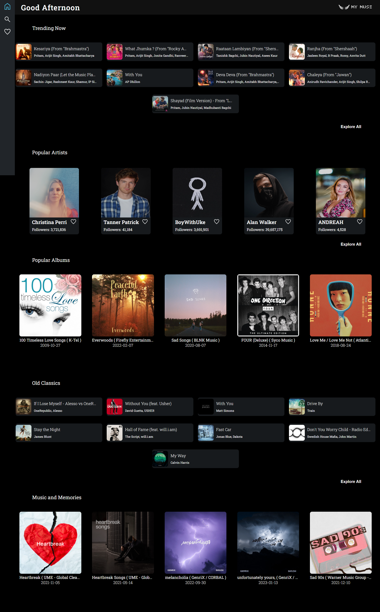
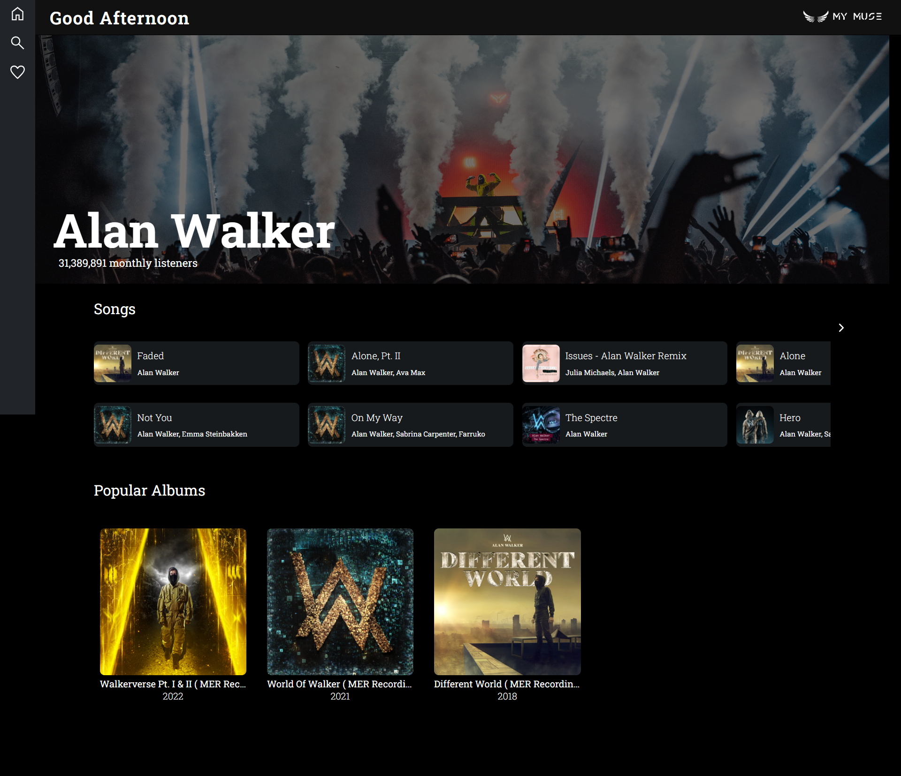
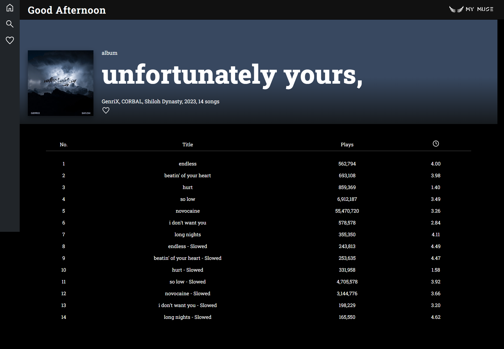
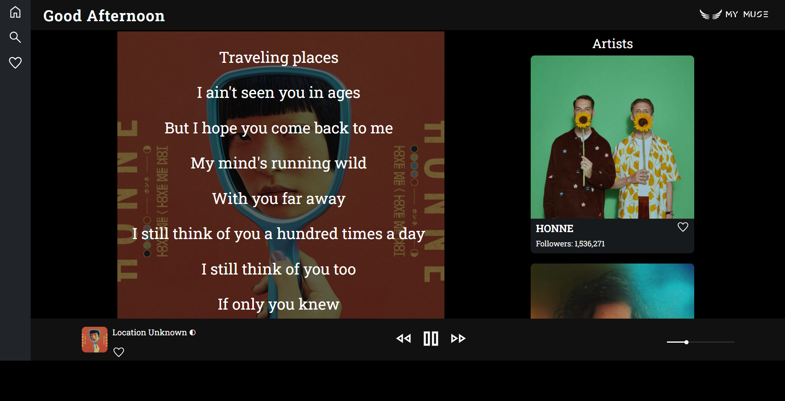
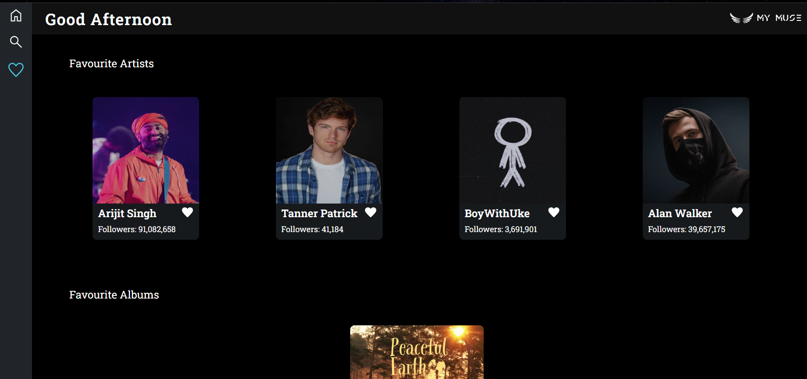
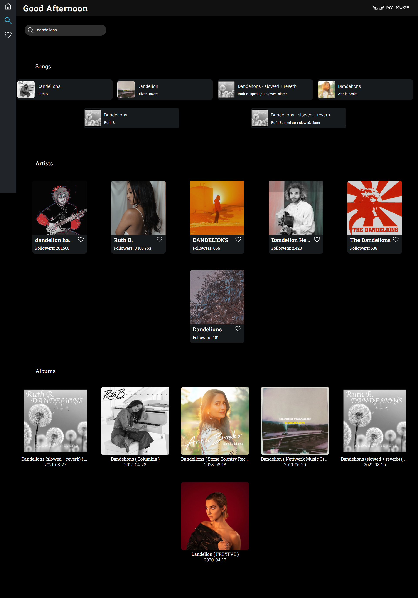

# MyMuse-Music-App

## Table of Contents

- [Live Site URL](#live-site-url)
- [Introduction](#introduction)
- [Features](#features)
- [Built with](#built-with)
- [API used](#api-used)

## Live Site URL

View live on- [https://my-muse-08b750.netlify.app/](https://my-muse-08b750.netlify.app/)

## Introduction

This is a music app built using React.js. It allows users to explore new music, listen to their favourite songs as well as add the songs, artists etc. they love in favourites. The app is designed to provide a seamless and enjoyable music listening experience.

## Features

This app allows users to-

- browse through various trending tracks, albums, playlists etc.
  

- listen to a particular artist's tracks and albums.
  

- listen to all the tracks of a particular album.
  

- have a look at the track details, lyrics and listen to its preview.
  

- like your favourite artists, albums and tracks and view them in favourites.
  

- search for tracks, albums and artists and get details about their number of followers, their top tracks and singles.
  

- view the optimal layout for the site depending on their device's screen size

- uses Skeleton Loading for good look and feel of app.

## Built with

- Semantic HTML5 markup
- CSS custom properties
- [React](https://reactjs.org/) - JS library
- Redux

## API used

- Spotify by Glavier (Rapid API): [https://rapidapi.com/Glavier/api/spotify23/](https://rapidapi.com/Glavier/api/spotify23/)
